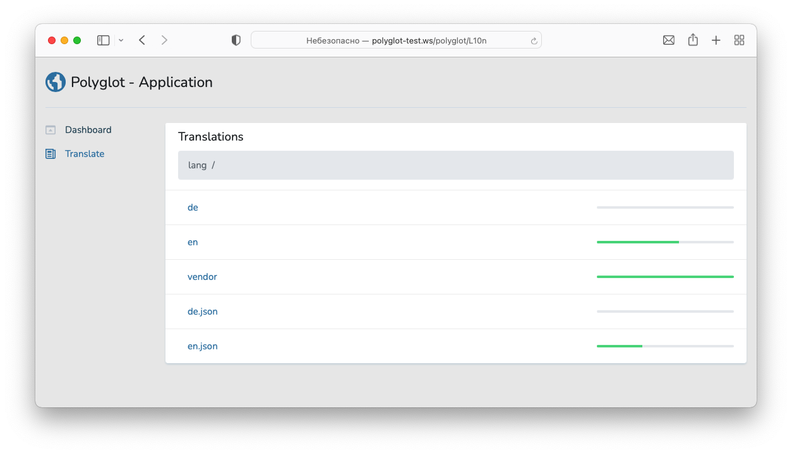
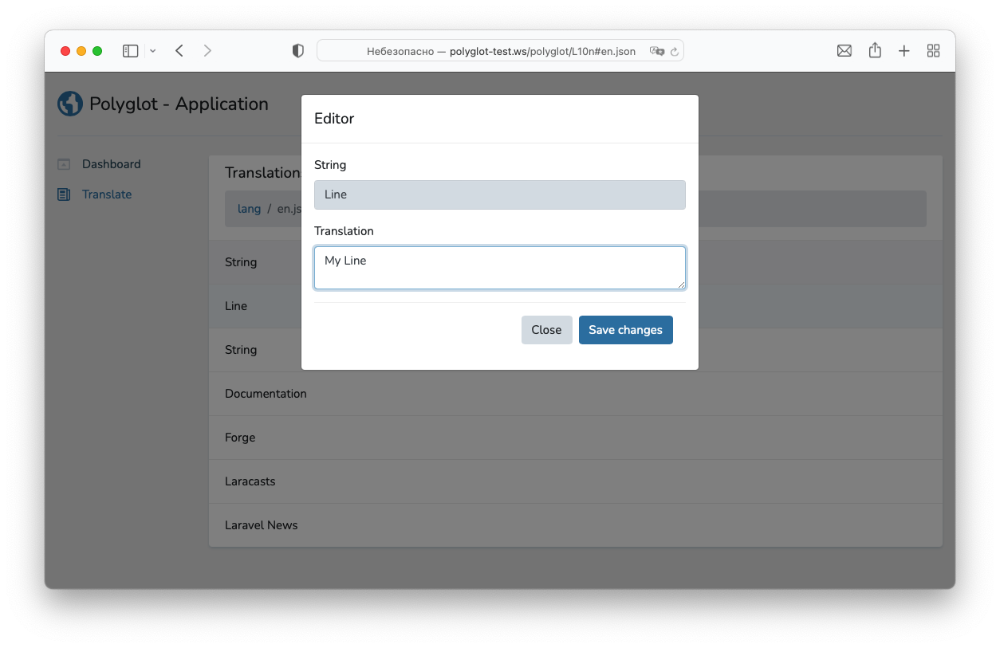

# Polyglot

- [Introduction](#introduction)
- [Installation](#installation)
- [Configuration](#configuration)
  - [Working Mode](#working-mode)
  - [Collecting Strings](#collecting-strings)
  - [Application Locales](#application-locales)
  - [Dashboard Authorization](#dashboard-authorization)
- [Upgrading Polyglot](#upgrading-polyglot)
- [Web Editor](#web-editor)
- [Strings Collector](#strings-collector)
- [Gettext Translator](#gettext-translator)
  - [Compatability with Laravel Translator](#compatability-with-laravel-translator)
  - [Multiple Text Domains](#multiple-text-domains)
- [About Gettext](#about-gettext)
  - [Supported Directives](#supported-directives)
  - [Markup Hints](#the-power-of-gettext)

## Introduction

Polyglot provides a beautiful translation editor and can extract translations strings from the application source codes.

With Polyglot you may be sure, that you application is fully localized.

> Before digging into Polyglot you should familiarize yourself with [Gettext](https://www.gnu.org/software/gettext/).

## Installation

Install [Gettext](https://www.gnu.org/software/gettext/) on your server and make sure, that php has `ext-gettext` extension enabled.

You may install Polyglot into your project using the Composer package manager:

    composer require codewiser/polyglot

After installing Polyglot, publish its assets using the `polyglot:install` Artisan command:

    php artisan polyglot:install

## Configuration

After publishing Polyglot's assets, its primary configuration file will be located at `config/polyglot.php`. This configuration file allows you to configure Polyglot working mode. Each configuration option includes a description of its purpose, so be sure to thoroughly explore this file.

### Working mode

    'enabled' => env('POLYGLOT_ENABLED', false),

If `disabled`, Polyglot provides only passive services — translation files editor and Artisan command for collecting translation strings from the source codes.

When `enabled`, Polyglot replaces Laravel Translation Service bringing Gettext support to the application.

Polyglot extends Laravel Translator and tries to translate strings using parent service. If Laravel Translator doesn't translate the string, Polyglot utilizes Gettext to find the translation.

### Collecting strings

Polyglot extracts strings from application's source codes using `xgettext` utility. So, the only extractor driver is

    'extractor' => 'xgettext',

The `xgettext` extractor should be properly configured. At least one group of source codes should be defined.

    'xgettext' => [
        [
            'sources' => [
                app_path(),
                resource_path('views')
            ],
            'exclude' => [],
        ]
    ],

### Application locales

After collecting strings, Polyglot will populate collected strings through every configured locale.

    'locales' => ['en_US', 'en_GB', 'it', 'es'],

### Dashboard Authorization

Polyglot exposes a dashboard at the /polyglot URI. By default, you will only be able to access this dashboard in the local environment. However, within your `app/Providers/PolyglotServiceProvider.php` file, there is an authorization gate definition. This authorization gate controls access to Polyglot in non-local environments. You are free to modify this gate as needed to restrict access to your Polyglot installation.

    /**
     * Register the Polyglot gate.
     *
     * This gate determines who can access Polyglot in non-local environments.
     *
     * @return void
     */
    protected function gate()
    {
        Gate::define('viewPolyglot', function ($user) {
            return in_array($user->email, [
                'username@example.com',
            ]);
        });
    }

#### Alternative Authentication Strategies

Remember that Laravel automatically injects the authenticated user into the gate closure. If your application is providing Polyglot security via another method, such as IP restrictions, then your Polyglot users may not need to "login". Therefore, you will need to change `function ($user)` closure signature above to `function ($user = null)` in order to force Laravel to not require authentication.

## Upgrading Polyglot

When upgrading to any new Polyglot version, you should re-publish Polyglot's assets:

    php artisan polyglot:publish

To keep the assets up-to-date and avoid issues in future updates, you may add the `polyglot:publish` command to the `post-update-cmd` scripts in your application's `composer.json` file:

    {
        "scripts": {
            "post-update-cmd": [
                "@php artisan polyglot:publish --ansi"
            ]
        }
    }

## Web editor

## Strings Collector

Once you have configured `xgettext` in your application's `config/polyglot.php` configuration file, you may collect strings using the polyglot Artisan command. This single command will collect all translation strings from the configured sources:

    php artisan polyglot:collect
  
Polyglot uses `xgettext` to collect translation strings, understanding even `trans`, `trans_choice`, `@trans` and other Laravel specific directives.

After collecting strings your application's `resourse/lang` folder may look like:

    resources/
      lang/
        es/
          auth.php
          passwords.php
        en_GB/
          auth.php
          passwords.php
        en_US/
          auth.php
          passwords.php
        it/
          auth.php
          passwords.php
        es.json
        en_GB.json
        en_US.json
        it.json

You only left to translate files.

## Gettext Translator

As Laravel Translator may hold strings in different files (that we call namespace), so Gettext may hold strings in different files (that is called text domains). The idea is alike, but there are a lot of difference.

Gettext may split strings by categories, described by php constants `LC_MESSAGES`, `LC_MONETARY`, `LC_TIME` and so on.

By default, Gettext stores collected strings in `messages` text domain and `LC_MESSAGES`category.

So, if you enable Polyglot, after you run `polyglot:collect` Artisan command, your application's `resourse/lang` folder may look like:

    resources/
      lang/
        es/
          LC_MESSAGES/
            messages.po
        en_GB/
          LC_MESSAGES/
            messages.po
        en_US/
          LC_MESSAGES/
            messages.po
        it/
          LC_MESSAGES/
            messages.po

Generated files contains collected string, that you might want to translate. After you have finished translation you should compile all `po` files to `mo` format, that is understandable by Gettext. Use Artisan command to compile.

    php artisan polyglot:compile

Beside every `po` file will appear `mo` file.

> Do remember, that php caches contents of `mo` files. So, after compiling, be sure, you have restarted the web server.

### Compatability with Laravel Translator

Even using Gettext driver, you may continue to use Laravel translator directives, such as `trans` and `trans_choice`.

Meanwhile, you may use Gettext directives, such as `gettext`, `ngettext` and others.

They are all understandable by Polyglot.

### Multiple Text Domains

Sometimes, you may want to divide your application's translation strings into few text domains, e.g. strings for frontend and strings for administrative panel.

You may configure additional text domains that way:

    'xgettext' => [
      [
        'text_domain' => 'frontend',
        'sources' => [
            app_path(),
            resource_path('views')
        ],
        'exclude' => resource_path('views/admin')
      ],
      [
        'text_domain' => 'admin', 
        'category' => LC_MESSAGES,
        'sources' => [
            resource_path('views/admin')
            resource_path('js/admin')
        ],
        'exclude' => []
      ],
    ],

After collecting strings, every locale in `resource/lang` will get two files: `frontend.po` and `admin.po`.

> Default value for `text_domain` is string `messages`. Default value for `category` is constant `LC_MESSAGES`.

By default, Polyglot will load into php memory the first configured text domain. You may load next text domain by accessing Laravel's `Lang` facade:

    Lang::setTextDomain('admin');

## About Gettext

### Supported Directives

Polyglot supports the following Gettext directives.

Lookup a message in the current text domain:

    gettext(string $message): string

Plural version of gettext:

    ngettext(string $singular, string $plural, int $count): string

Particular version of gettext allows to define context:

    pgettext(string $context, string $message): string

Particular version of ngettext.
  
    npgettext(string $context, string $singular, string $plural, int $count): string

> Other directives, that allows to override current text domain and category are also supported.

### The Power of Gettext

Gettext can be very helpful for the translator. Use following recipes to get localization done well.

#### References

Gettext extracts references of the string, so translator may suppose the context.

    #: /sources/php/second.php:3 /sources/js/first.js:1
    msgid "Short message"
    msgstr ""

#### Developer comments

Gettext may extract developer comment, that might be helpful for translator.

    #. The message will be shown at test page only.
    msgid "Hello world"
    msgstr ""

That is originated from such source code:

    // The message will be shown at test page only.
    echo gettext('Hello world');

#### Message context

The developer may explicitly define the message context.

    gettext('May');
    pgettext('Month', 'May');

Here we have two messages with equal `msgid` but with different `msgctxt` that is actually a part of string key.

    msgid "May"
    msgstr ""
    
    msgctxt "Month"
    msgid "May"
    msgstr ""

#### Translator comments

While editing strings, translator may left one or many comments. This comments may be helpful for future translators.

    # They say it was about posibilities...
    msgid "May"
    msgstr ""

#### Fuzzy strings

Both Gettext (while parsing source codes) and a translator may mark string as fuzzy. It means that a string, previously situated on that place, was changed, so current translation might no longer be appropriate.

    #, fuzzy
    msgid "May"
    msgstr ""