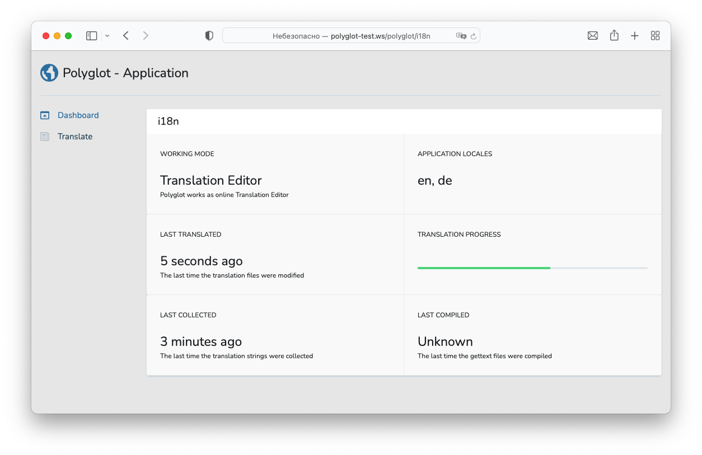
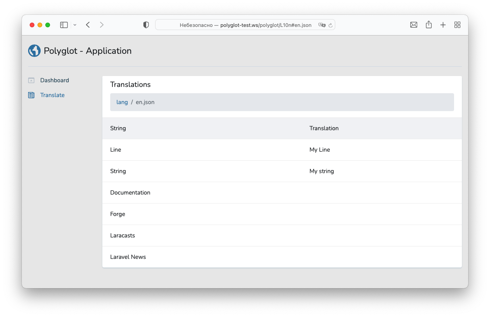
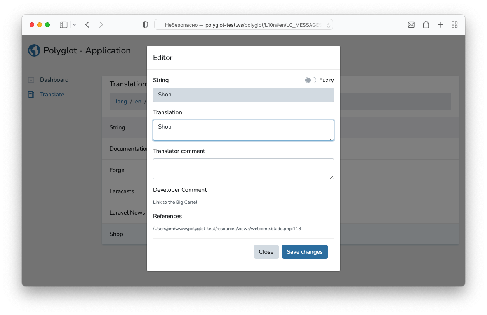

# Polyglot

- [Introduction](#introduction)
- [Installation](#installation)
- [Configuration](#configuration)
- [Upgrading Polyglot](#upgrading-polyglot)
- [Web Editor](#web-editor)
- [Strings Collector](#strings-collector)
- [Gettext Translator](#gettext-translator)
- [Vue|JavaScript Support](#vue-and-javascript-support)

## Introduction

Polyglot provides a beautiful translation editor and can extract translations strings from the application source codes.



With Polyglot you may be sure, that you application is fully localized.

## Installation

Install [Gettext](https://www.gnu.org/software/gettext/) on your server and make sure, that php has `ext-gettext` extension enabled.

Now you are ready to install Polyglot into your project using the Composer package manager:

```shell
composer require codewiser/polyglot
```

After installing Polyglot, publish its assets using the `polyglot:install` Artisan command:

```shell
php artisan polyglot:install
```

## Configuration

After publishing Polyglot's assets, its primary configuration file will be located at `config/polyglot.php`. This configuration file allows you to configure Polyglot working mode. Each configuration option includes a description of its purpose, so be sure to thoroughly explore this file.

## Upgrading Polyglot

When upgrading to any new Polyglot version, you should re-publish Polyglot's assets:

```shell
php artisan polyglot:publish
```

To keep the assets up-to-date and avoid issues in future updates, you may add the `polyglot:publish` command to the `post-update-cmd` scripts in your application's `composer.json` file:

```json
{
    "scripts": {
        "post-update-cmd": [
            "@php artisan polyglot:publish --ansi"
        ]
    }
}
```

## Web editor





### Configuration

#### Dashboard Authorization

Polyglot exposes a dashboard at the `/polyglot` URI. By default, you will only be able to access this dashboard in the local environment.

> It is not recommended to use Polyglot in non-local environments, as Polyglot modifies files in `resources/lang`.

However, within your `app/Providers/PolyglotServiceProvider.php` file, there is an authorization gate definition. This authorization gate controls access to Polyglot in non-local environments. You are free to modify this gate as needed to restrict access to your Polyglot installation.

```php
/**
 * Register the Polyglot gate.
 *
 * This gate determines who can access Polyglot in non-local environments.
 *
 * @return void
 */
protected function gate()
{
    Gate::define('viewPolyglot', function ($user) {
        return in_array($user->email, [
            'username@example.com',
        ]);
    });
}
```

##### Alternative Authentication Strategies

Remember that Laravel automatically injects the authenticated user into the gate closure. If your application is providing Polyglot security via another method, such as IP restrictions, then your Polyglot users may not need to "login". Therefore, you will need to change `function ($user)` closure signature above to `function ($user = null)` in order to force Laravel to not require authentication.

## Strings Collector

### Configuration

Define at least one group of source files to collect strings from.

```php
'sources' => [
    [
        'include' => [
            app_path(),
            resource_path('views')
        ],
        'exclude' => [],
    ]
],
```

#### Application locales

Gettext depends on server support of locales. 
For example, your application provides Italian language (`it`). 
And your server supports following locales:

``` bash
> locale -a | grep it

it_CH
it_CH.utf8
it_IT
it_IT@euro
it_IT.utf8
```

Then you should list system locales in order of preference.
Read more at https://www.php.net/manual/en/function.setlocale.php

```php
'locales' => [
    'en' => ['en_US', 'en_US.utf8', 'en_US.UTF-8'] 
    'it' => ['it_IT', 'it_IT.utf8', 'it_IT.UTF-8'], 
    'es' => ['es_ES', 'es_ES.utf8', 'es_ES.UTF-8'],
],
```

After collecting strings, Polyglot will populate collected strings through every configured locale.

### Collecting strings

Once you have configured `sources` in your application's `config/polyglot.php` configuration file, you may collect strings using the polyglot Artisan command. This single command will collect all translation strings from the configured sources:

```shell
php artisan polyglot:collect
```

Polyglot uses `sources` to collect translation strings, understanding `trans`, `trans_choice`, `@trans` and other Laravel specific directives.

After collecting strings your application's `resourse/lang` folder may look like:

    resources/
      lang/
        es/
          auth.php
          passwords.php
        en/
          auth.php
          passwords.php
        it/
          auth.php
          passwords.php
        es.json
        en.json
        it.json

You only left to translate files.

### Loading Strings

Polyglot provides `AcceptLanguage` middleware that may help to set proper locale to the application.

```php
class AcceptLanguage
{
    public function handle(Request $request, Closure $next)
    {
        app()->setLocale($request->getPreferredLanguage(Polyglot::getLocales()));

        return $next($request);
    }
}
```

## Gettext Translator

> Before reading, you should familiarize yourself with [Gettext](https://www.gnu.org/software/gettext/).

### Configuration

Set `POLYGLOT_GETTEXT=true` environment variable to use Gettext to localize your application.

```php
'enabled' => env('POLYGLOT_GETTEXT', true),
```

#### Text Domains

You may configure additional group of source files that way:

```php
'sources' => [
  [
    'text_domain' => 'frontend',
    'include' => [
        app_path(),
        resource_path('views'),
    ],
    'exclude' => resource_path('views/admin'),
  ],
  [
    'text_domain' => 'backend',
    'include' => [
        resource_path('views/admin'),
    ],
    'exclude' => [],
  ],
],
```

> Default value for `text_domain` is string `messages`.

### Collecting strings

After you run `polyglot:collect` Artisan command, your application's `resourse/lang` folder may look like:

    resources/
      lang/
        es/
          LC_MESSAGES/
            backend.po
            frontend.po
        en/
          LC_MESSAGES/
            backend.po
            frontend.po
        it/
          LC_MESSAGES/
            backend.po
            frontend.po

### Compiling strings

Generated files contains collected string, that you might want to translate. After you have finished translation you should compile all `po` files to `mo` format, that is understandable by Gettext. Use Artisan command to compile.

```shell
php artisan polyglot:compile
```

Beside every `po` file will appear `mo` file.

> Do remember, that php caches contents of `mo` files. So, after compiling, be sure, you have restarted the web server.

### Backward Compatability

Even using Gettext driver, you may continue to use Laravel translator directives, such as `trans` and `trans_choice`.

Meanwhile, you may use Gettext directives, such as `gettext`, `ngettext` and others.

They are all understandable by Polyglot.

### Loading Text Domain

By default, Polyglot will load into php memory the first configured text domain.

If you configure few text domains, you may load next text domain by accessing Laravel's `Lang` facade:

```php
Lang::setTextDomain('frontend');
```

### Supported Directives

Polyglot supports the following Gettext directives.

Lookup a message in the current text domain:

```php
gettext(string $message): string
```

Plural version of gettext:

```php
ngettext(string $singular, string $plural, int $count): string
```

Particular version of gettext allows to define context:

```php
pgettext(string $context, string $message): string
```

Particular version of ngettext.

```php
npgettext(string $context, string $singular, string $plural, int $count): string
```

> Other directives, that allows to override current text domain and category are also supported.

### The Power of Gettext



Gettext can be very helpful for the translator. Use following recipes to get localization done well.

#### References

Gettext extracts references of the string, so translator may suppose the context.

    #: /sources/php/second.php:3 /sources/js/first.js:1
    msgid "Short message"
    msgstr ""

#### Developer comments

Gettext may extract developer comment, that might be helpful for translator.

    #. The message will be shown at test page only.
    msgid "Hello world"
    msgstr ""

That was originated from such source code:

```php
// The message will be shown at test page only.
echo gettext('Hello world');
```

#### Message context

The developer may explicitly define the message context.

    gettext('May');
    pgettext('Month', 'May');

Here we have two messages with equal `msgid` but with different `msgctxt` that is actually a part of string key.

    msgid "May"
    msgstr ""
    
    msgctxt "Month"
    msgid "May"
    msgstr ""

#### Translator comments

While editing strings, translator may left one or many comments. This comments may be helpful for future translators.

    # They say it was about posibilities...
    msgid "May"
    msgstr ""

#### Fuzzy strings

Both Gettext (while parsing source codes) and a translator may mark string as fuzzy. It means that a string, previously situated on that place, was changed, so current translation might no longer be appropriate.

    #, fuzzy
    msgid "May"
    msgstr ""

## Vue and JavaScript Support

Vue and JavaScript sources supported as well.

### Compiling Strings

Artisan `polyglot:compile` command will compile every translation file into `json` format and put them into `storage` folder. After compiling `storage/lang` may look like:

    storage/
      lang/
        es/
          frontend.json
        en/
          frontend.json
        it/
          frontend.json

You may use these files to localize the frontend.

Polyglot provides `translations.js` that your application may use as mixin. Polyglot dashboard localized that way.

